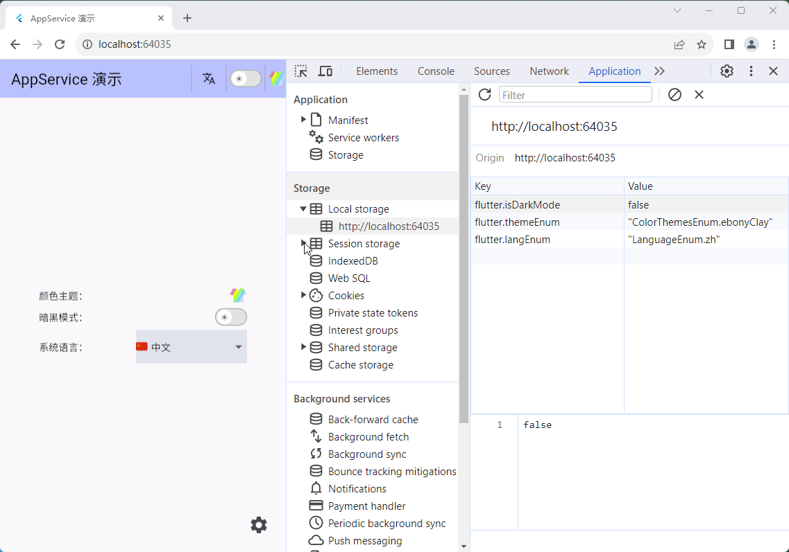

# App Service

[中文文档]()

An application service based on [GetX](https://pub.dev/packages/get), which provides application-level management services, such as theme management, dark mode management and localization management.


**Author:** [Jack Lee]()

**Email:** [291148484@163.com](291148484@163.com)

---

## 1. Getting Started

You can install the latest version of **App Service** in your project using the `flutter pub add` command:

```shell
flutter pub add app_seivice
```

This will add `app_seivice` as a dependency in the `dependencies` section of your project's `pubspec.yaml` file and implicitly run `flutter pub get` once.

## 2. Managing App Service in dependency injection

In an actual project, there may be many dependencies to be managed besides AppService, so I like to create an injections.dart file to describe the dependencies.
The following example uses the [GetIt](https://pub.dev/packages/get_it) library to manage dependencies. You can also use other dependency management schemes, depending on your own habits.

```dart
import 'package:app_service/app_service.dart';
import 'package:get_it/get_it.dart';

/// Dependency injection based on Get it library
class GetitInjection {
  static void init() {
    final GetIt i = GetIt.instance;
    AppService appService = AppService(
      supportedLanguages: const [
        LanguageEnum.zh,
        LanguageEnum.en,
      ],
      defaultLang: LanguageEnum.zh,
    );
    i.registerLazySingleton<AppService>(() => appService); 
  }
}
```


### 2.1 Theme Management


Theme management in application service is used to switch different color themes, and each theme contains two modes, namely dark mode and light mode.
There are many theme data generated by [flex_color_scheme](https://pub.dev/packages/flex_color_scheme) built into the library.

The following is the built-in theme table:

| Theme Name | Light Theme | Dark Theme |
|------------|--------------|-------------|
| amberBlue   | amberBlueLightTheme | amberBlueDarkTheme |
| aquaBlue    | aquaBlueLightTheme | aquaBlueDarkTheme |
| bahamaTrinidad | bahamaTrinidadLightTheme | bahamaTrinidadDarkTheme |
| barossa     | barossaLightTheme | barossaDarkTheme |
| bigStoneTulip  | bigStoneTulipLightTheme | bigStoneTulipDarkTheme |
| blueDelight  | blueDelightLightTheme | blueDelightDarkTheme |
| blueStoneTeal | blueStoneTealLightTheme | blueStoneTealDarkTheme |
| blueWhale    | blueWhaleLightTheme | blueWhaleDarkTheme |
| blumine      | blumineLightTheme | blumineDarkTheme |
| brandBlue    | brandBlueLightTheme | brandBlueDarkTheme |
| brownOrange  | brownOrangeLightTheme | brownOrangeDarkTheme |
| camaroneGreen | camaroneGreenLightTheme | camaroneGreenDarkTheme |
| damaskLunar  | damaskLunarLightTheme | damaskLunarDarkTheme |
| deepBlueSea  | deepBlueSeaLightTheme | deepBlueSeaDarkTheme |
| deepPurple   | deepPurpleLightTheme | deepPurpleDarkTheme |
| dellGenoaGreen | dellGenoaGreenLightTheme | dellGenoaGreenDarkTheme |
| ebonyClay    | ebonyClayLightTheme | ebonyClayDarkTheme |
| eggplantPurple | eggplantPurpleLightTheme | eggplantPurpleDarkTheme |
| endeavourBlue | endeavourBlueLightTheme | endeavourBlueDarkTheme |
| espressoCrema | espressoCremaLightTheme | espressoCremaDarkTheme |
| flutterDash  | flutterDashLightTheme | flutterDashDarkTheme |
| goldSunset   | goldSunsetLightTheme | goldSunsetDarkTheme |
| greens      | greensLightTheme | greensDarkTheme |
| greenForest  | greenForestLightTheme | greenForestDarkTheme |
| greenJungle  | greenJungleLightTheme | greenJungleDarkTheme |
| greenMoney   | greenMoneyLightTheme | greenMoneyDarkTheme |
| greyLaw      | greyLawLightTheme | greyLawDarkTheme |
| hippieBlue   | hippieBlueLightTheme | hippieBlueDarkTheme |
| indigoNight  | indigoNightLightTheme | indigoNightDarkTheme |
| indigoSanMarino | indigoSanMarinoLightTheme | indigoSanMarinoDarkTheme |
| lipstickPink | lipstickPinkLightTheme | lipstickPinkDarkTheme |
| mallardValencia | mallardValenciaLightTheme | mallardValenciaDarkTheme |
| mangoMojito  | mangoMojitoLightTheme | mangoMojitoDarkTheme |
| material3   | material3LightTheme | material3DarkTheme |
| material3HighContrast | material3HighContrastLightTheme | material3HighContrastDarkTheme |
| material3Purple | material3PurpleLightTheme | material3PurpleDarkTheme |
| midnight    | midnightLightTheme | midnightDarkTheme |
| mosqueCyan   | mosqueCyanLightTheme | mosqueCyanDarkTheme |
| ohMandyRed   | ohMandyRedLightTheme | ohMandyRedDarkTheme |
| outerSpace   | outerSpaceLightTheme | outerSpaceDarkTheme |
| pinkSakura   | pinkSakuraLightTheme | pinkSakuraDarkTheme |
| purpleBrown  | purpleBrownLightTheme | purpleBrownDarkTheme |
| redBlue      | redBlueLightTheme | redBlueDarkTheme |
| redTornado   | redTornadoLightTheme | redTornadoDarkTheme |
| redWine      | redWineLightTheme | redWineDarkTheme |
| rosewood     | rosewoodLightTheme | rosewoodDarkTheme |
| rustDeepOrange | rustDeepOrangeLightTheme | rustDeepOrangeDarkTheme |
| sanJuanBlue  | sanJuanBlueLightTheme | sanJuanBlueDarkTheme |
| sharkOrange  | sharkOrangeLightTheme | sharkOrangeDarkTheme |
| thunderbirdRed | thunderbirdRedLightTheme | thunderbirdRedDarkTheme |
| verdunGreen  | verdunGreenLightTheme | verdunGreenDarkTheme |
| verdunLime   | verdunLimeLightTheme | verdunLimeDarkTheme |
| vesuviusBurned | vesuviusBurnedLightTheme | vesuviusBurnedDarkTheme |
| willowWasabi | willowWasabiLightTheme | willowWasabiDarkTheme |
| yukonGoldYellow | yukonGoldYellowLightTheme | yukonGoldYellowDarkTheme |

## 2. Theme Management

To switch themes, you can use the `setColorTheme` method of the **AppService** instance to toggle themes. The method signature is as follows:

```dart
void setColorTheme(ColorThemesEnum themeEnum)
```

For example:

```dart
// Get the AppService instance
final AppService appService = GetIt.instance.get<AppService>();

// Switch the theme to bigStoneTulip
appService.setColorTheme(ColorThemesEnum.bigStoneTulip);
```

You can use the **ThemeModal** modal component to provide users with a more intuitive theme selection, for example:

```dart
const ThemeModal(),
```

It displays as a theme icon on the page:


If you touch or click on the icon, a dialog will appear to allow users to choose a theme:


Each theme is displayed in the modal as a circle with its `primaryColor`, and the selected theme has a checkmark next to its circle.

### 2.2 Dark Mode Management

In the `App Service` library, Dark/Light mode is treated as two sub-states under the same theme, essentially defining two sets of corresponding theme data. You can directly toggle dark mode using the `toggleDarkMode` method in the AppService singleton:

```dart
// Get the AppService singleton
final AppService appService = GetIt.instance.get<AppService>();
// Toggle dark mode
appService.toggleDarkMode();
```

Additionally, on the instance object `appService`, there are methods `setDarkMode` and `setLightMode` for setting dark and light modes, respectively.

**DarkModeSwitch** is a toggle switch for dark mode that you can use directly in your code. In appearance, it looks like this:


### 3. Localization

**Messages** is a translation container that accepts a list, which can contain multiple translations. Its type signature is:

```dart
Messages Messages(
    List<Map<String, Map<String, String>>> translations
)
```

You should pass it into the **GetMaterialApp** top-level component via the `translations` parameter, and it must include a `AppServiceMessages().keys` in the list, which is a translation file for **App Service**. For example:

```dart
GetMaterialApp(
  translations: Messages([
    AppServiceMessages().keys,
    // Other translations
    HomeMessages().keys,
  ]),
);
```

Here, **HomeMessages** is a hypothetical custom translation file that looks like this:

```dart
import 'package:get/get.dart';

class HomeMessages extends Translations {
  @override
  Map<String, Map<String, String>> get keys => {
        'zh_CN': {
          'home.appService_demo': 'AppService 演示',
        },
        'en': {
          'home.appService_demo': 'AppService Demo',
        },
        'ko_KR': {
          'home.appService_demo': 'AppService 데모',
        },
        'ja_JP': {
          'home.appService_demo': 'AppService デモ',
        },
        // More language translate...
      };
}
```

Certainly, depending on the project's needs, you can define more translation files and load them in the `translations` list of **Messages**.

When implementing internationalization, defining the supported languages is done by specifying the `supportedLanguages` parameter of the **AppService**. It accepts a list composed of multiple **LanguageEnum** enum values. **AppService** also needs to specify a default language. For example:

```dart
AppService appService = AppService(
  supportedLanguages: const [
    LanguageEnum.zh,
    LanguageEnum.en,
    LanguageEnum.fr,
  ],
  defaultLang: LanguageEnum.zh,
);
```

Here, the default value for `defaultLang` is *LanguageEnum.en*. This definition needs to correspond to the `locale` parameter in the top-level component.

The application title cannot be translated using the `.tr` provided by **GetX** because this method is not available before the initialization of the top-level component. This is especially evident in the localization switch effect on the **Web**:


To achieve dynamic switching, you can use a `switch` statement, as shown in the example below:

```dart
import 'package:app_service/app_service.dart';

// ...
GetMaterialApp(
  // ...
  title: switch (Get.locale?.languageCode) {
    'zh' => 'AppService 演示',
    'en' => 'AppService Demo',
    'fr' => 'AppService démonstration',
    'ja' => 'AppServiceデモ',
    'ko' => 'App 서비스 데모',
    'ar' => 'تطبيق AppService',
    _ => 'AppService Demo',
  },
  translations: Messages([
    AppServiceMessages().keys,
    HomeMessages().keys,
  ]),
  locale: const Locale('zh', 'CN'),
  fallbackLocale: const Locale('en', 'US'),
  home: const HomeView(),
);

```

To switch languages, you can use the `updateLocale` method on the **AppService** instance. The method signature is:

```dart
void updateLocale(LanguageEnum newLanguage)
```

For example:

```dart
appService.updateLocale(LanguageEnum.zh);
```

There are two components available for displaying a language selection menu to switch the local language: **LangSelectMenu** and **Wen**.

**LangSelectMenu** is a regular square dropdown button, for example:

```dart
const LangSelectMenu(),
```

It looks like this:


**Wen** is also a button with a pop-up menu, but it is displayed with an icon, usually in the **Header**:

```dart
const Wen()
```

It looks like this:


You can customize the displayed icon, as well as the size of the icon, and it can be any widget.


## 3. Initialization

Initialization is used to read user data from persistent storage. The **AppService** instance provides an `init` method for its own initialization.

In your application, there are various ways to perform initialization. For example, the following code demonstrates initialization through the `onInit` method of the top-level component **GetMaterialApp**:

```dart
// ...
void main() async {
  runApp(const MyApp());
}

class MyApp extends StatelessWidget {
  const MyApp({super.key});

  Future<void> onInit(BuildContext context) async {
    // Init AppService
    final appService = GetIt.instance.get<AppService>();
    await appService.init();
    // ...Other initializations
  }

  @override
  Widget build(BuildContext context) {
    final appService = GetIt.instance.get<AppService>();

    return GetMaterialApp(
      // ...
      onInit: () async {
        await onInit(context);
      },
    );
  }
}
```


## 4. Web App

In the Web App, the current [sharedPreferencesWeb](https://pub.dev/packages/shared_preferences_web) library utilizes [localStorage](https://developer.mozilla.org/en-US/docs/Web/API/Window/localStorage) for key-value pair storage. If there are changes to the relevant states managed by AppService, these changes will be directly reflected in the browser's localStorage:




## 5. Example App

You can find an example application for **App Service** at [https://github.com/jacklee1995/flutter_app_service/tree/master/example](https://github.com/jacklee1995/flutter_app_service/tree/master/example).


## 6. Appendix

### About version

The recommended **GetX** version for each App Service release is shown in the table below:

| App Service | GetX |
| :---------- | :--- |
| 1.0.0       | 4.6  |

The versions are relatively close and generally compatible.

### Enums

#### LanguageEnum

```dart
/// Enum representing different language codes.
enum LanguageEnum {
  zh,      // Chinese
  zhHans,  // Chinese (Simplified)
  zhHant,  // Chinese (Traditional)
  zhHk,    // Chinese (Hong Kong)
  zhTw,    // Chinese (Taiwan)
  ru,      // Russian
  de,      // German
  fr,      // French
  ja,      // Japanese
  ko,      // Korean
  es,      // Spanish
  ar,      // Arabic
  en,      // English
  enUs,    // English (United States)
  enUk,    // English (United Kingdom)
  pt,      // Portuguese
  it,      // Italian
  nl,      // Dutch
  tr,      // Turkish
  hi,      // Hindi
  id,      // Indonesian
  vi,      // Vietnamese
  th,      // Thai
  ms,      // Malay
  fil,     // Filipino
  sv,      // Swedish
  pl,      // Polish
  hu,      // Hungarian
  ro,      // Romanian
  cs,      // Czech
  el,      // Greek
  he,      // Hebrew
  da,      // Danish
  fi,      // Finnish
  no,      // Norwegian
  sk,      // Slovak
  sl,      // Slovenian
  bg,      // Bulgarian
  af,      // Afrikaans
  sq,      // Albanian
  hy,      // Armenian
  az,      // Azerbaijani
  eu,      // Basque
  bn,      // Bengali
  bs,      // Bosnian
  ca,      // Catalan
  hr,      // Croatian
  cy,      // Welsh
  et,      // Estonian
  tl,      // Filipino
  gl,      // Galician
  ka,      // Georgian
  gu,      // Gujarati
  ht,      // Haitian Creole
  ha,      // Hausa
  haw,     // Hawaiian
  iw,      // Hebrew
  jw,      // Javanese
  kk,      // Kazakh
  km,      // Khmer
  kn,      // Kannada
  ky,      // Kyrgyz
  lo,      // Lao
  la,      // Latin
  lv,      // Latvian
  lt,      // Lithuanian
  lb,      // Luxembourgish
  mk,      // Macedonian
  mg,      // Malagasy
  mt,      // Maltese
  mi,      // Maori
  mr,      // Marathi
  mn,      // Mongolian
  ne,      // Nepali
  ps,      // Pashto
  pa,      // Punjabi
  qu,      // Quechua
  gd,      // Scottish Gaelic
  sr,      // Serbian
  st,      // Sesotho
  sn,      // Shona
  sd,      // Sindhi
  si,      // Sinhala
  su,      // Sundanese
  sw,      // Swahili
  tg,      // Tajik
  ta,      // Tamil
  te,      // Telugu
  ur,      // Urdu
  uz,      // Uzbek
  xh,      // Xhosa
  yi,      // Yiddish
  zu,      // Zulu
}
```


#### ColorThemesEnum

```dart
/// Enum representing different color themes, including the name of each theme.
enum ColorThemesEnum {
  /// Amber Blue
  amberBlue,

  /// Aqua Blue
  aquaBlue,

  /// Bahama Trinidad
  bahamaTrinidad,

  /// Barossa
  barossa,

  /// Big Stone Tulip
  bigStoneTulip,

  /// Blue Delight
  blueDelight,

  /// Blue Stone Teal
  blueStoneTeal,

  /// Blue Whale
  blueWhale,

  /// Blumine
  blumine,

  /// Brand Blue
  brandBlue,

  /// Brown Orange
  brownOrange,

  /// Camarone Green
  camaroneGreen,

  /// Damask Lunar
  damaskLunar,

  /// Deep Blue Sea
  deepBlueSea,

  /// Deep Purple
  deepPurple,

  /// Dell Genoa Green
  dellGenoaGreen,

  /// Ebony Clay
  ebonyClay,

  /// Eggplant Purple
  eggplantPurple,

  /// Endeavour Blue
  endeavourBlue,

  /// Espresso Crema
  espressoCrema,

  /// Flutter Dash
  flutterDash,

  /// Gold Sunset
  goldSunset,

  /// Greens
  greens,

  /// Green Forest
  greenForest,

  /// Green Jungle
  greenJungle,

  /// Green Money
  greenMoney,

  /// Grey Law
  greyLaw,

  /// Hippie Blue
  hippieBlue,

  /// Indigo Night
  indigoNight,

  /// Indigo San Marino
  indigoSanMarino,

  /// Lipstick Pink
  lipstickPink,

  /// Mallard Valencia
  mallardValencia,

  /// Mango Mojito
  mangoMojito,

  /// Material3
  material3,

  /// Material3 High Contrast
  material3HighContrast,

  /// Material3 Purple
  material3Purple,

  /// Midnight
  midnight,

  /// Mosque Cyan
  mosqueCyan,

  /// Oh Mandy Red
  ohMandyRed,

  /// Outer Space
  outerSpace,

  /// Pink Sakura
  pinkSakura,

  /// Purple Brown
  purpleBrown,

  /// Red Blue
  redBlue,

  /// Red Tornado
  redTornado,

  /// Red Wine
  redWine,

  /// Rosewood
  rosewood,

  /// Rust Deep Orange
  rustDeepOrange,

  /// San Juan Blue
  sanJuanBlue,

  /// Shark Orange
  sharkOrange,

  /// Thunderbird Red
  thunderbirdRed,

  /// Verdun Green
  verdunGreen,

  /// Verdun Lime
  verdunLime,

  /// Vesuvius Burned
  vesuviusBurned,

  /// Willow Wasabi
  willowWasabi,

  /// Yukon Gold Yellow
  yukonGoldYellow,
}
```


#### Utils

##### Lang

```dart
/// Language enum value to string
String? langEnumToStr(LanguageEnum lang)
```


```dart
/// Convert the language logo to the corresponding country logo
String getCountryCode(String item)
```


```dart
/// Convert a language string to the corresponding language enum
LanguageEnum? strToLangEnum(String langStr)
```


##### Theme

```dart
/// Combine color themes with dark mode and return the corresponding ThemeData object.
/// - themeName: The name of the theme.
/// - isDarkMode: Whether to use dark mode.
ThemeData getThemeDataByName(String themeName, bool isDarkMode)
```


```dart
/// Get theme data (ThemeData) based on the enum.
ThemeData getThemeDataByEnum(ColorThemesEnum themeEnum, bool isDarkMode)
```


## 7. Issue Tracker

You can report issues on Github: https://github.com/jacklee1995/flutter_app_service/issues


## 8. licence

This project is licensed under the MIT License - see the [LICENSE](https://github.com/jacklee1995/flutter_app_service/blob/master/LICENSE) file for details.


---

