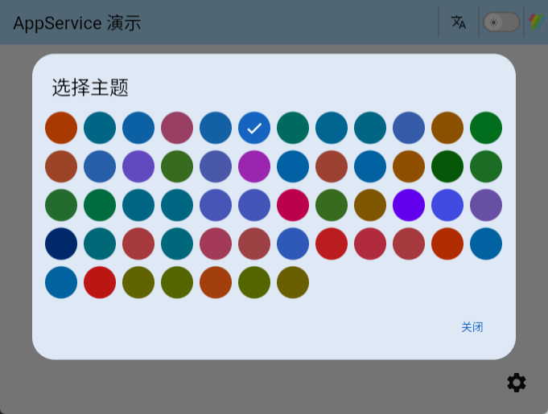
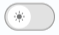
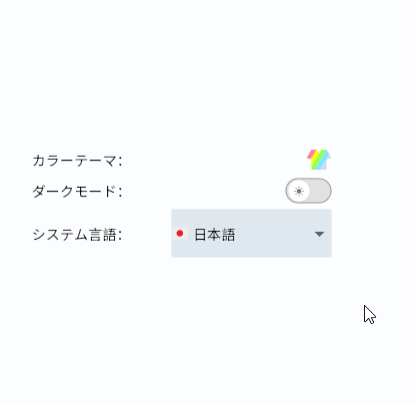

# App Service

> [Major Update in Version 4.0.0]: Added system dark mode follow feature. If dark mode is manually set, the system follow feature is automatically disabled.

App Service is an application service based on [GetX](https://pub.dev/packages/get), providing application-level management services such as theme management, dark mode management, and localization management.


**作者:** [李俊才](http://thispage.tech)

**邮箱:** [291148484@163.com](291148484@163.com)

---


## 1. Getting Started Guide

You can install the latest version of **App Service** in your project using the `flutter pub add` command:

```shell
flutter pub add app_service
```

This will add `app_service` as a dependency in the `dependencies` field of your project's `pubspec.yaml` file and implicitly run `flutter pub get`.

## 2. Managing App Service in Dependency Injection

In real projects, besides AppService, there may be many other dependencies that need to be managed. Therefore, I like to create an `injections.dart` file to describe these dependencies.
The following example uses the [Get](https://pub.dev/packages/get) library to manage dependencies.

```dart
import 'package:app_service/app_service.dart';
import 'package:get/instance_manager.dart';
import 'package:shared_preferences/shared_preferences.dart';

Future<void> initDependencies() async {
  final SharedPreferences prefs = await SharedPreferences.getInstance();
  Get.put<SharedPreferences>(prefs);

  // 应用管理
  Get.lazyPut<AppService>(
    () => AppService(
      Get.find<SharedPreferences>(),
      supportedLanguages: const [
        LanguageEnum.zh,
        LanguageEnum.zhHk,
        LanguageEnum.zhMO,
        LanguageEnum.zhTW,
        LanguageEnum.en,
        LanguageEnum.enUK,
        LanguageEnum.enUS,
        LanguageEnum.de,
        LanguageEnum.ru,
        LanguageEnum.uk,
        LanguageEnum.be,
        LanguageEnum.kk,
        LanguageEnum.sr,
        LanguageEnum.fr,
        LanguageEnum.ja,
        LanguageEnum.ko,
        LanguageEnum.ar,
      ],
    ),
    fenix: true,
  );
}
```

In older versions, you needed to configure the default language using `defaultLang: LanguageEnum.zh,`. Currently, the first configuration in the list serves as the default.

### 2.1 主题管理

应用服务中的主题管理用于切换不同的颜色主题，每个主题包含两种模式，即深色模式和浅色模式。
库中内置了由 [flex_color_scheme](https://pub.dev/packages/flex_color_scheme) 生成的许多主题数据。

以下是内置主题表：

| Theme Name            | Light Theme                     | Dark Theme                     |
| --------------------- | ------------------------------- | ------------------------------ |
| amberBlue             | amberBlueLightTheme             | amberBlueDarkTheme             |
| aquaBlue              | aquaBlueLightTheme              | aquaBlueDarkTheme              |
| bahamaTrinidad        | bahamaTrinidadLightTheme        | bahamaTrinidadDarkTheme        |
| barossa               | barossaLightTheme               | barossaDarkTheme               |
| bigStoneTulip         | bigStoneTulipLightTheme         | bigStoneTulipDarkTheme         |
| blueDelight           | blueDelightLightTheme           | blueDelightDarkTheme           |
| blueStoneTeal         | blueStoneTealLightTheme         | blueStoneTealDarkTheme         |
| blueWhale             | blueWhaleLightTheme             | blueWhaleDarkTheme             |
| blumine               | blumineLightTheme               | blumineDarkTheme               |
| brandBlue             | brandBlueLightTheme             | brandBlueDarkTheme             |
| brownOrange           | brownOrangeLightTheme           | brownOrangeDarkTheme           |
| camaroneGreen         | camaroneGreenLightTheme         | camaroneGreenDarkTheme         |
| damaskLunar           | damaskLunarLightTheme           | damaskLunarDarkTheme           |
| deepBlueSea           | deepBlueSeaLightTheme           | deepBlueSeaDarkTheme           |
| deepPurple            | deepPurpleLightTheme            | deepPurpleDarkTheme            |
| dellGenoaGreen        | dellGenoaGreenLightTheme        | dellGenoaGreenDarkTheme        |
| ebonyClay             | ebonyClayLightTheme             | ebonyClayDarkTheme             |
| eggplantPurple        | eggplantPurpleLightTheme        | eggplantPurpleDarkTheme        |
| endeavourBlue         | endeavourBlueLightTheme         | endeavourBlueDarkTheme         |
| espressoCrema         | espressoCremaLightTheme         | espressoCremaDarkTheme         |
| flutterDash           | flutterDashLightTheme           | flutterDashDarkTheme           |
| goldSunset            | goldSunsetLightTheme            | goldSunsetDarkTheme            |
| greens                | greensLightTheme                | greensDarkTheme                |
| greenForest           | greenForestLightTheme           | greenForestDarkTheme           |
| greenJungle           | greenJungleLightTheme           | greenJungleDarkTheme           |
| greenMoney            | greenMoneyLightTheme            | greenMoneyDarkTheme            |
| greyLaw               | greyLawLightTheme               | greyLawDarkTheme               |
| hippieBlue            | hippieBlueLightTheme            | hippieBlueDarkTheme            |
| indigoNight           | indigoNightLightTheme           | indigoNightDarkTheme           |
| indigoSanMarino       | indigoSanMarinoLightTheme       | indigoSanMarinoDarkTheme       |
| lipstickPink          | lipstickPinkLightTheme          | lipstickPinkDarkTheme          |
| mallardValencia       | mallardValenciaLightTheme       | mallardValenciaDarkTheme       |
| mangoMojito           | mangoMojitoLightTheme           | mangoMojitoDarkTheme           |
| material3             | material3LightTheme             | material3DarkTheme             |
| material3HighContrast | material3HighContrastLightTheme | material3HighContrastDarkTheme |
| material3Purple       | material3PurpleLightTheme       | material3PurpleDarkTheme       |
| midnight              | midnightLightTheme              | midnightDarkTheme              |
| mosqueCyan            | mosqueCyanLightTheme            | mosqueCyanDarkTheme            |
| ohMandyRed            | ohMandyRedLightTheme            | ohMandyRedDarkTheme            |
| outerSpace            | outerSpaceLightTheme            | outerSpaceDarkTheme            |
| pinkSakura            | pinkSakuraLightTheme            | pinkSakuraDarkTheme            |
| purpleBrown           | purpleBrownLightTheme           | purpleBrownDarkTheme           |
| redBlue               | redBlueLightTheme               | redBlueDarkTheme               |
| redTornado            | redTornadoLightTheme            | redTornadoDarkTheme            |
| redWine               | redWineLightTheme               | redWineDarkTheme               |
| rosewood              | rosewoodLightTheme              | rosewoodDarkTheme              |
| rustDeepOrange        | rustDeepOrangeLightTheme        | rustDeepOrangeDarkTheme        |
| sanJuanBlue           | sanJuanBlueLightTheme           | sanJuanBlueDarkTheme           |
| sharkOrange           | sharkOrangeLightTheme           | sharkOrangeDarkTheme           |
| thunderbirdRed        | thunderbirdRedLightTheme        | thunderbirdRedDarkTheme        |
| verdunGreen           | verdunGreenLightTheme           | verdunGreenDarkTheme           |
| verdunLime            | verdunLimeLightTheme            | verdunLimeDarkTheme            |
| vesuviusBurned        | vesuviusBurnedLightTheme        | vesuviusBurnedDarkTheme        |
| willowWasabi          | willowWasabiLightTheme          | willowWasabiDarkTheme          |
| yukonGoldYellow       | yukonGoldYellowLightTheme       | yukonGoldYellowDarkTheme       |

Switching themes can be achieved using the `setColorTheme` method of the **AppService** instance object, which has the following type signature:

```dart
void setColorTheme(ColorThemesEnum themeEnum)
```

For example:

```dart
// Get the AppService instance
final AppService appService = GetIt.instance.get<AppService>();

// Switch theme to bigStoneTulip
appService.setColorTheme(ColorThemesEnum.bigStoneTulip);
```

#### ThemeModal

You can use the **ThemeModal** modal dialog component to provide users with a more intuitive theme selection, for example:

```dart
const ThemeModal(),
```

It displays as a theme icon on the page:


If you touch or click on this icon, a dialog will appear for the user to select a theme:



Each theme will be displayed as a circular shape with its `primaryColor` in the modal, and the selected theme will have a checkmark symbol.

Starting from version `3.0.0`, you can specify available themes in the **ThemeModal** component using the `themes` parameter. If not specified or specified as an empty array, all built-in themes will be used by default.

#### showThemeModal

`showThemeModal` is a function that provides more flexibility compared to **ThemeModal**. For example:

```dart
// 某一个组件的onTap参数
onTap: (_) {
  showThemeModal(
    context,
    themes: [
      ColorThemesEnum.amberBlue,
      ColorThemesEnum.brownOrange,
      ColorThemesEnum.dellGenoaGreen,
      ColorThemesEnum.camaroneGreen,
    ],
  );
},
```

### 2.2 Dark Mode Management

In the `App Service` library, Dark/Light mode is two sub-states under the same theme, essentially defining two sets of corresponding theme data. You can directly toggle dark mode using the `toggleDarkMode` method in the singleton of AppService:

```dart
// Get the singleton instance of AppService
final AppService appService = GetIt.instance.get<AppService>();
// Toggle dark mode
appService.toggleDarkMode()
```

Additionally, on the instance object `appService`, methods `setDarkMode` and `setLightMode` are available for setting dark/light mode.

**DarkModeSwitch** is a readily usable switch for toggling dark mode, which you can directly utilize in your code. In appearance, it looks like this:



### 2.3 Follow System Mode

Starting from V4.0.0, a new feature of following the system's dark mode has been added. By changing the value of `followSystem` property in AppService, you can set whether to follow the system. Once you manually change the dark mode, the value of `followSystem` will be set to false. `followSystem` is a variable of type `RxBool`, meaning it is reactive. For example:

```dart
Obx(
  () => Row(
    mainAxisAlignment: MainAxisAlignment.spaceBetween,
    children: [
      Text('app_service.follow_system'.tr + 'app_service.:'.tr),
      Checkbox(
        value: Get.find<AppService>().followSystem.value,
        onChanged: (value) {
          Get.find<AppService>().followSystem.value = value!;
          Get.find<AppService>().saveFollowSystem();
        },
      ),
    ],
  ),
),
```


The behavior of system mode follow varies across different platforms; on Windows platform, it forcibly follows the system's dark mode.

## 3. Localization

### 3.1 Messages

**Messages** is a translation container that accepts a list, which can contain multiple translations. Its type signature is:

```dart
Messages Messages(
    List<Map<String, Map<String, String>>> translations
)
```

You should pass it into the top-level component **GetMaterialApp** through the `translations` parameter, and it must include `AppServiceMessages().keys` in the list, which is a translation file for **App Service**. For example:

```dart
GetMaterialApp(
  translations: Messages([
    AppServiceMessages().keys,
    // Other translations
    HomeMessages().keys,
  ]),
);
```

Where **HomeMessages** is an assumed custom translation file, it looks like this:

```dart
import 'package:get/get.dart';

class HomeMessages extends Translations {
  @override
  Map<String, Map<String, String>> get keys => {
        'zh_CN': {
          'home.appService_demo': 'AppService 演示',
        },
        'en': {
          'home.appService_demo': 'AppService Demo',
        },
        'ko_KR': {
          'home.appService_demo': 'AppService 데모',
        },
        'ja_JP': {
          'home.appService_demo': 'AppService デモ',
        },
        // More language translate...
      };
}
```
Of course, depending on the needs of your project, you can define more translation files like this and load them in the `translations` list of **Messages**.

When implementing internationalization, specifying the supported languages is done through the `supportedLanguages` parameter of the **AppService** constructor. It accepts a list composed of multiple **LanguageEnum** enum values. Additionally, **AppService** needs to specify a default language. For example:

```dart
AppService appService = AppService(
  supportedLanguages: const [
    LanguageEnum.zh,
    LanguageEnum.en,
    LanguageEnum.fr,
  ],
  defaultLang: LanguageEnum.zh,
);
```
The default value of `defaultLang` is *LanguageEnum.en*. This definition needs to correspond with the `locale` parameter in the top-level component.

The application title cannot be translated using **GetX**'s `.tr` because this method is unavailable before the initialization of the top-level component. This limitation is particularly noticeable in the localization switch effect on the **Web**:


To achieve this dynamic switching, you can use a `switch` statement as shown in the following example:

```dart
import 'package:app_service/app_service.dart';

// ...
GetMaterialApp(
  // ...
  title: switch (Get.locale?.languageCode) {
    'zh' => 'AppService 演示',
    'en' => 'AppService Demo',
    'fr' => 'AppService démonstration',
    'ja' => 'AppServiceデモ',
    'ko' => 'App 서비스 데모',
    'ar' => 'تطبيق AppService',
    _ => 'AppService Demo',
  },
  translations: Messages([
    AppServiceMessages().keys,
    HomeMessages().keys,
  ]),
  locale: const Locale('zh', 'CN'),
  home: const HomeView(),
);

```

To switch languages, you can use the `updateLocale` method on the **AppService** instance object, which has the following type signature:

```dart
void updateLocale(LanguageEnum newLanguage)
```

For example:

```dart
appService.updateLocale(LanguageEnum.zh);
```

### 3.2 Switching Local Language

There are two **Widgets** available for displaying a language selection menu to switch the local language: **LangSelectMenu** and **Wen**.

#### 3.2.1 LangSelectMenu

**LangSelectMenu** is a regular rectangular dropdown button, for example:

```dart
const LangSelectMenu(),
```

It looks like this:



**Wen** is also a button for a popup menu, but it displays an icon, typically used within a **Header**:

```dart
const Wen()
```

It appears as follows:


You can customize the displayed icon, its size, and it can be any widget.

#### LanguageSelectPage & CupertinoLanguageSelectPage

If you wish to select a language in a settings page, you may consider using **LanguageSelectPage** or **CupertinoLanguageSelectPage** components. These components represent a language selection page, which you can open from a settings item.


## 3. Web App

In a Web App, the current [sharedPreferencesWeb](https://pub.dev/packages/shared_preferences_web) library implements key-value pair storage through [localStorage](https://developer.mozilla.org/en-US/docs/Web/API/Window/localStorage). Changes in relevant states managed by the AppService will be directly reflected in the browser's localStorage:


## 4. Example App

You can find an example application of **App Service** at [https://github.com/jacklee1995/flutter_app_service/tree/master/example](https://github.com/jacklee1995/flutter_app_service/tree/master/example).

## 5. Appendix

### About Versions

The App Service library depends on the following modules.

You can install any version you prefer; any GetX version within a major version range should work:

| Library | Recommended Major Version |
| :------ | :------------------------ |
| GetX    | 4.6                       |

Versions within a small difference are generally compatible.

### Enums

#### LanguageEnum

```dart
/// Enum representing different language codes.
enum LanguageEnum {
  zh,      // Chinese
  zhHans,  // Chinese (Simplified)
  zhHant,  // Chinese (Traditional)
  zhHk,    // Chinese (Hong Kong)
  zhTw,    // Chinese (Taiwan)
  ru,      // Russian
  de,      // German
  fr,      // French
  ja,      // Japanese
  ko,      // Korean
  es,      // Spanish
  ar,      // Arabic
  en,      // English
  enUs,    // English (United States)
  enUk,    // English (United Kingdom)
  pt,      // Portuguese
  it,      // Italian
  nl,      // Dutch
  tr,      // Turkish
  hi,      // Hindi
  id,      // Indonesian
  vi,      // Vietnamese
  th,      // Thai
  ms,      // Malay
  fil,     // Filipino
  sv,      // Swedish
  pl,      // Polish
  hu,      // Hungarian
  ro,      // Romanian
  cs,      // Czech
  el,      // Greek
  he,      // Hebrew
  da,      // Danish
  fi,      // Finnish
  no,      // Norwegian
  sk,      // Slovak
  sl,      // Slovenian
  bg,      // Bulgarian
  af,      // Afrikaans
  sq,      // Albanian
  hy,      // Armenian
  az,      // Azerbaijani
  eu,      // Basque
  bn,      // Bengali
  bs,      // Bosnian
  ca,      // Catalan
  hr,      // Croatian
  cy,      // Welsh
  et,      // Estonian
  tl,      // Filipino
  gl,      // Galician
  ka,      // Georgian
  gu,      // Gujarati
  ht,      // Haitian Creole
  ha,      // Hausa
  haw,     // Hawaiian
  iw,      // Hebrew
  jw,      // Javanese
  kk,      // Kazakh
  km,      // Khmer
  kn,      // Kannada
  ky,      // Kyrgyz
  lo,      // Lao
  la,      // Latin
  lv,      // Latvian
  lt,      // Lithuanian
  lb,      // Luxembourgish
  mk,      // Macedonian
  mg,      // Malagasy
  mt,      // Maltese
  mi,      // Maori
  mr,      // Marathi
  mn,      // Mongolian
  ne,      // Nepali
  ps,      // Pashto
  pa,      // Punjabi
  qu,      // Quechua
  gd,      // Scottish Gaelic
  sr,      // Serbian
  st,      // Sesotho
  sn,      // Shona
  sd,      // Sindhi
  si,      // Sinhala
  su,      // Sundanese
  sw,      // Swahili
  tg,      // Tajik
  ta,      // Tamil
  te,      // Telugu
  ur,      // Urdu
  uz,      // Uzbek
  xh,      // Xhosa
  yi,      // Yiddish
  zu,      // Zulu
}
```

#### ColorThemesEnum

```dart
/// Enum representing different color themes, including the name of each theme.
enum ColorThemesEnum {
  /// Amber Blue
  amberBlue,

  /// Aqua Blue
  aquaBlue,

  /// Bahama Trinidad
  bahamaTrinidad,

  /// Barossa
  barossa,

  /// Big Stone Tulip
  bigStoneTulip,

  /// Blue Delight
  blueDelight,

  /// Blue Stone Teal
  blueStoneTeal,

  /// Blue Whale
  blueWhale,

  /// Blumine
  blumine,

  /// Brand Blue
  brandBlue,

  /// Brown Orange
  brownOrange,

  /// Camarone Green
  camaroneGreen,

  /// Damask Lunar
  damaskLunar,

  /// Deep Blue Sea
  deepBlueSea,

  /// Deep Purple
  deepPurple,

  /// Dell Genoa Green
  dellGenoaGreen,

  /// Ebony Clay
  ebonyClay,

  /// Eggplant Purple
  eggplantPurple,

  /// Endeavour Blue
  endeavourBlue,

  /// Espresso Crema
  espressoCrema,

  /// Flutter Dash
  flutterDash,

  /// Gold Sunset
  goldSunset,

  /// Greens
  greens,

  /// Green Forest
  greenForest,

  /// Green Jungle
  greenJungle,

  /// Green Money
  greenMoney,

  /// Grey Law
  greyLaw,

  /// Hippie Blue
  hippieBlue,

  /// Indigo Night
  indigoNight,

  /// Indigo San Marino
  indigoSanMarino,

  /// Lipstick Pink
  lipstickPink,

  /// Mallard Valencia
  mallardValencia,

  /// Mango Mojito
  mangoMojito,

  /// Material3
  material3,

  /// Material3 High Contrast
  material3HighContrast,

  /// Material3 Purple
  material3Purple,

  /// Midnight
  midnight,

  /// Mosque Cyan
  mosqueCyan,

  /// Oh Mandy Red
  ohMandyRed,

  /// Outer Space
  outerSpace,

  /// Pink Sakura
  pinkSakura,

  /// Purple Brown
  purpleBrown,

  /// Red Blue
  redBlue,

  /// Red Tornado
  redTornado,

  /// Red Wine
  redWine,

  /// Rosewood
  rosewood,

  /// Rust Deep Orange
  rustDeepOrange,

  /// San Juan Blue
  sanJuanBlue,

  /// Shark Orange
  sharkOrange,

  /// Thunderbird Red
  thunderbirdRed,

  /// Verdun Green
  verdunGreen,

  /// Verdun Lime
  verdunLime,

  /// Vesuvius Burned
  vesuviusBurned,

  /// Willow Wasabi
  willowWasabi,

  /// Yukon Gold Yellow
  yukonGoldYellow,
}
```

#### Utils

##### Lang

```dart
/// Language enum value to string
String? langEnumToStr(LanguageEnum lang)
```

```dart
/// Convert the language logo to the corresponding country logo
String getCountryCode(String item)
```

```dart
/// Convert a language string to the corresponding language enum
LanguageEnum? strToLangEnum(String langStr)
```

##### Theme

```dart
/// Combine color themes with dark mode and return the corresponding ThemeData object.
/// - themeName: The name of the theme.
/// - isDarkMode: Whether to use dark mode.
ThemeData getThemeDataByName(String themeName, bool isDarkMode)
```

```dart
/// Get theme data (ThemeData) based on the enum.
ThemeData getThemeDataByEnum(ColorThemesEnum themeEnum, bool isDarkMode)
```

## 7. Issue Tracker

You can report issues on Github: https://github.com/jacklee1995/flutter_app_service/issues

## 8. licence

This project is licensed under the MIT License - see the [LICENSE](https://github.com/jacklee1995/flutter_app_service/blob/master/LICENSE) file for details.
