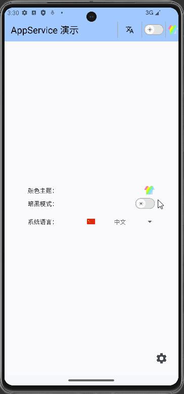
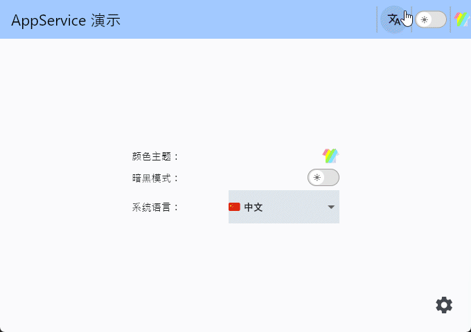
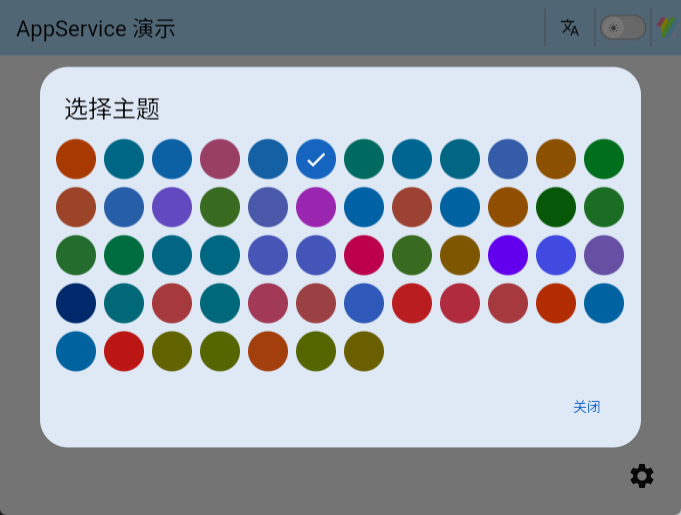
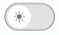
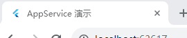
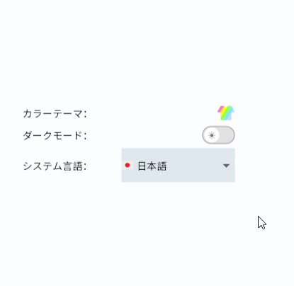

# App Service

App Service 是一个基于 [GetX](https://pub.dev/packages/get) 的应用服务，提供应用级别的管理服务，如主题管理、深色模式管理和本地化管理。






**作者:** [Jack Lee]()

**邮箱:** [291148484@163.com](291148484@163.com)

---

## 1. 入门指南

你可以使用`flutter pub add`命令在你的项目中安装**App Service**的最新版本：

```shell
flutter pub add app_seivice
```

这将在项目的`pubspec.yaml`文件的 `dependencies`字段中添加`app_seivice`作为依赖，并隐式地运行一次`flutter pub get`。


## 2. 在依赖注入中管理 App Service

在实际项目中，除了 AppService 外，可能还有许多其他需要管理的依赖项，因此我喜欢创建一个 injections.dart 文件来描述这些依赖项。
以下示例使用 [GetIt](https://pub.dev/packages/get_it) 库来管理依赖项。您还可以根据自己的习惯使用其他依赖管理方案。

```dart
import 'package:app_service/app_service.dart';
import 'package:get_it/get_it.dart';

/// 基于 Get it 库的依赖注入
class GetitInjection {
  static void init() {
    final GetIt i = GetIt.instance;
    AppService appService = AppService(
      supportedLanguages: const [
        LanguageEnum.zh,
        LanguageEnum.en,
      ],
      defaultLang: LanguageEnum.zh,
    );
    i.registerLazySingleton<AppService>(() => appService); 
  }
}
```


### 2.1 主题管理


应用服务中的主题管理用于切换不同的颜色主题，每个主题包含两种模式，即深色模式和浅色模式。
库中内置了由 [flex_color_scheme](https://pub.dev/packages/flex_color_scheme) 生成的许多主题数据。

以下是内置主题表：

| 主题名称（中文） | 亮色主题 | 暗色主题 |
|------------------|--------------|-------------|
| 琥珀蓝   | amberBlueLightTheme | amberBlueDarkTheme |
| 青蓝    | aquaBlueLightTheme | aquaBlueDarkTheme |
| 巴哈马特立尼达 | bahamaTrinidadLightTheme | bahamaTrinidadDarkTheme |
| 巴罗萨     | barossaLightTheme | barossaDarkTheme |
| 大石郁金香  | bigStoneTulipLightTheme | bigStoneTulipDarkTheme |
| 蓝色的欢愉  | blueDelightLightTheme | blueDelightDarkTheme |
| 蓝石青 | blueStoneTealLightTheme | blueStoneTealDarkTheme |
| 蓝鲸    | blueWhaleLightTheme | blueWhaleDarkTheme |
| 布卢曼      | blumineLightTheme | blumineDarkTheme |
| 品牌蓝    | brandBlueLightTheme | brandBlueDarkTheme |
| 棕橙  | brownOrangeLightTheme | brownOrangeDarkTheme |
| 卡玛龙绿 | camaroneGreenLightTheme | camaroneGreenDarkTheme |
| 丝绒和月亮  | damaskLunarLightTheme | damaskLunarDarkTheme |
| 深蓝海  | deepBlueSeaLightTheme | deepBlueSeaDarkTheme |
| 深紫   | deepPurpleLightTheme | deepPurpleDarkTheme |
| 戴尔热那亚绿 | dellGenoaGreenLightTheme | dellGenoaGreenDarkTheme |
| 乌木粘土    | ebonyClayLightTheme | ebonyClayDarkTheme |
| 茄子紫   | eggplantPurpleLightTheme | eggplantPurpleDarkTheme |
| 企业家蓝  | endeavourBlueLightTheme | endeavourBlueDarkTheme |
| 浓缩咖啡奶油  | espressoCremaLightTheme | espressoCremaDarkTheme |
| Flutter Dash  | flutterDashLightTheme | flutterDashDarkTheme |
| 金黄日落   | goldSunsetLightTheme | goldSunsetDarkTheme |
| 绿    | greensLightTheme | greensDarkTheme |
| 绿色森林  | greenForestLightTheme | greenForestDarkTheme |
| 绿色丛林  | greenJungleLightTheme | greenJungleDarkTheme |
| 绿钱    | greenMoneyLightTheme | greenMoneyDarkTheme |
| 灰色法律  | greyLawLightTheme | greyLawDarkTheme |
| 嬉皮蓝   | hippieBlueLightTheme | hippieBlueDarkTheme |
| 靛蓝之夜  | indigoNightLightTheme | indigoNightDarkTheme |
| 靛蓝圣马力诺 | indigoSanMarinoLightTheme | indigoSanMarinoDarkTheme |
| 唇膏粉   | lipstickPinkLightTheme | lipstickPinkDarkTheme |
| 野鸭瓦伦西亚 | mallardValenciaLightTheme | mallardValenciaDarkTheme |
| 芒果莫吉托  | mangoMojitoLightTheme | mangoMojitoDarkTheme |
| material3 | material3LightTheme | material3DarkTheme |
| Material3 高对比 | material3HighContrastLightTheme | material3HighContrastDarkTheme |
| Material3 紫色  | material3PurpleLightTheme | material3PurpleDarkTheme |
| 午夜   | midnightLightTheme | midnightDarkTheme |
| 清真寺青  | mosqueCyanLightTheme | mosqueCyanDarkTheme |
| 哦曼迪红  | ohMandyRedLightTheme | ohMandyRedDarkTheme |
| 外太空舞台 | outerSpaceLightTheme | outerSpaceDarkTheme |
| 粉红樱花  | pinkSakuraLightTheme | pinkSakuraDarkTheme |
| 紫褐   | purpleBrownLightTheme | purpleBrownDarkTheme |
| 红蓝   | redBlueLightTheme | redBlueDarkTheme |
| 红色龙卷风  | redTornadoLightTheme | redTornadoDarkTheme |
| 红酒   | redWineLightTheme | redWineDarkTheme |
| 红木   | rosewoodLightTheme | rosewoodDarkTheme |
| 锈橙色  | rustDeepOrangeLightTheme | rustDeepOrangeDarkTheme |
| 圣胡安蓝  | sanJuanBlueLightTheme | sanJuanBlueDarkTheme |
| 鲨鱼橙   | sharkOrangeLightTheme | sharkOrangeDarkTheme |
| 雷鸟红   | thunderbirdRedLightTheme | thunderbirdRedDarkTheme |
| 威尔敦绿  | verdunGreenLightTheme | verdunGreenDarkTheme |
| 威尔敦酸橙 | verdunLimeLightTheme | verdunLimeDarkTheme |
| 尼古拉斯烧焦 | vesuviusBurnedLightTheme | vesuviusBurnedDarkTheme |
| 柳树芥末   | willowWasabiLightTheme | willowWasabiDarkTheme |
| 育空金黄 | yukonGoldYellowLightTheme | yukonGoldYellowDarkTheme |

要切换主题，你可以使用**AppService**实例对象的`setColorTheme`对主题进行切换，该方法的类型签名为：

```dart
void setColorTheme(ColorThemesEnum themeEnum)
```

例如：

```dart
// 获取 AppService 实例
final AppService appService = GetIt.instance.get<AppService>();

// 切换主题为 bigStoneTulip
appService.setColorTheme(ColorThemesEnum.bigStoneTulip);
```

你可以使用**ThemeModal**模态框组件来为用户提供更加直观的主题选择，例如：

```dart
const ThemeModal(),
```

它以一个主题图标的形式显示在页面上：


如果触摸或点击该图标，将会以对话框的形式为用户提供主题选择：



每一个主题将以其`primaryColor`色的圆形显示在该模态框中，被选中的主题对应的圆形有一个“√”号。

### 2.2 Dark Mode Management

在 `App Service` 库中，Dark/Light 模式是同一主题下的两个子状态，本质上是定义了两组对应的主题数据。你可以直接在AppSeivice的单例中，通过 `toggleDarkMode` 方法切换暗黑模式：

```dart
// 获取 AppService 单例
final AppService appService = GetIt.instance.get<AppService>();
// 切换暗黑模式
appService.toggleDarkMode()
```

另外，实例对象`appService`上，用于设置暗黑/光亮的方法还有`setDarkMode`和`setLightMode`。

**DarkModeSwitch** 是一个可以直接使用的暗黑模式切换开关，你可以直接在代码中使用它。外观上，它看起来就像这样：




### 3. Localization

**Messages**是一个翻译容器，它接受一个列表，可以用来包含多个翻译。其类型签名为：

```dart
Messages Messages(
    List<Map<String, Map<String, String>>> translations
)
```

你应该在顶级组件 **GetMaterialApp** 中通过`translations`参数传入它，并且必须在列表中包含一个`AppServiceMessages().keys`，这是一份用于**App Service**的翻译文件。例如：

```dart
GetMaterialApp(
  translations: Messages([
    AppServiceMessages().keys,
    // 其它翻译
    HomeMessages().keys,
  ]),
);
```

其中，**HomeMessages**是一个假定的自定义翻译文件，它看起来像这样：

```dart
import 'package:get/get.dart';

class HomeMessages extends Translations {
  @override
  Map<String, Map<String, String>> get keys => {
        'zh_CN': {
          'home.appService_demo': 'AppService 演示',
        },
        'en': {
          'home.appService_demo': 'AppService Demo',
        },
        'ko_KR': {
          'home.appService_demo': 'AppService 데모',
        },
        'ja_JP': {
          'home.appService_demo': 'AppService デモ',
        },
        // More language translate...
      };
}
```

当然，依据项目的需要你可以定义更多这样的翻译文件，并在**Messages**的`translations`列表中加载。

实现国际化时，定义支持的多种语言是通过构造**AppService**的`supportedLanguages`参数指定的，它接受由多个**LanguageEnum** 枚举值所构成的列表。**AppService**还需要指定一个默认的语言。例如：

```dart
AppService appService = AppService(
  supportedLanguages: const [
    LanguageEnum.zh,
    LanguageEnum.en,
    LanguageEnum.fr,
  ],
  defaultLang: LanguageEnum.zh,
);
```

其中，`defaultLang`的默认值为 *LanguageEnum.en*。这里的定义需要与顶层组件中的`locale`参数对应。

应用标题是不能使用**GetX**提供的`.tr`来实现翻译的，因为在顶层组件初始化完成之前该方法不可用。这在 **Web** 端的本地化切换效果尤为明显：



为了实现这种动态切换，你可以像我一样使用一个`switch`语句，下面是一个示例：

```dart
import 'package:app_service/app_service.dart';

// ...
GetMaterialApp(
  // ...
  title: switch (Get.locale?.languageCode) {
    'zh' => 'AppService 演示',
    'en' => 'AppService Demo',
    'fr' => 'AppService démonstration',
    'ja' => 'AppServiceデモ',
    'ko' => 'App 서비스 데모',
    'ar' => 'تطبيق AppService',
    _ => 'AppService Demo',
  },
  translations: Messages([
    AppServiceMessages().keys,
    HomeMessages().keys,
  ]),
  locale: const Locale('zh', 'CN'),
  fallbackLocale: const Locale('en', 'US'),
  home: const HomeView(),
);

```

要切换语言，可以使用**AppService**实例对象上的`updateLocale`方法，该方法的类型签名为：

```dart
void updateLocale(LanguageEnum newLanguage)
```

例如：

```dart
appService.updateLocale(LanguageEnum.zh);
```

有两个组件可以用于显示一个语言选择菜单以切换本地语言，分别是**LangSelectMenu**和**Wen**。

其中，**LangSelectMenu**是一个普通的方形下拉按钮，例如：

```dart
const LangSelectMenu(),
```

看起来像这样：



**Wen**也是一个弹出菜单的按钮，只不过它以一个图标显示，这通常同于**Header**中：

```dart
const Wen()
```

看起来就像这样：


你可以自定义显示的图标，以及图标的大小，并且它可以是任何组件。


## 3. Initialization

初始化用于从持久化的数据中读取用户上一次存储的数据。在**AppService** 实例上提供了一个`init`方法用于完成其自身的相关初始化工作。

在你的应用中，可以使用多种方式完成初始化，例如，下面的代码展示了通过顶层组件**GetMaterialApp**的`onInit`方法实现初始化：

```dart
// ...
void main() async {
  runApp(const MyApp());
}

class MyApp extends StatelessWidget {
  const MyApp({super.key});

  Future<void> onInit(BuildContext context) async {
    // Init AppService
    final appService = GetIt.instance.get<AppService>();
    await appService.init();
    // ...Other initializations
  }

  @override
  Widget build(BuildContext context) {
    final appService = GetIt.instance.get<AppService>();

    return GetMaterialApp(
      // ...
      onInit: () async {
        await onInit(context);
      },
    );
  }
}
```


## 4. Web App

在 Web App 中，当前的 [sharedPreferencesWeb](https://pub.dev/packages/shared_preferences_web) 库通过 [localStorage](https://developer.mozilla.org/en-US/docs/Web/API/Window/localStorage) 实现键值对存储。如果改变 AppService 所管理的相关状态，这些变化将直接反映在浏览器的 localStorage 中：


## 5. Example App

你可以在[https://github.com/jacklee1995/flutter_app_service/tree/master/example](https://github.com/jacklee1995/flutter_app_service/tree/master/example)中找到 **App Service** 的示例应用。


## 6. Appendix

### About version

各个版本所依赖的 **GetX** 推荐版本如下表所示：

| App Service | GetX |
| :---------- | :--- |
| 1.0.0       | 4.6  |

版本相差不大都可以通用。


### Enums

#### LanguageEnum

```dart
/// 枚举表示不同的语言代码。
enum LanguageEnum {
  zh, // 中文(
  zhHans, // 中文(简体)
  zhHant, // 中文(繁体)
  zhHk, // 中文(香港)
  zhTw, // 中文(台湾)
  ru, // 俄语
  de, // 德语
  fr, // 法语
  ja, // 日语
  ko, // 韩语
  es, // 西班牙语
  ar, // 阿拉伯语
  en, // 英语
  enUs, // 英语（美国）
  enUk, // 英语（英国）
  pt, // 葡萄牙语
  it, // 意大利语
  nl, // 荷兰语
  tr, // 土耳其语
  hi, // 印地语
  id, // 印尼语
  vi, // 越南语
  th, // 泰语
  ms, // 马来语
  fil, // 菲律宾语
  sv, // 瑞典语
  pl, // 波兰语
  hu, // 匈牙利语
  ro, // 罗马尼亚语
  cs, // 捷克语
  el, // 希腊语
  he, // 希伯来语
  da, // 丹麦语
  fi, // 芬兰语
  no, // 挪威语
  sk, // 斯洛伐克语
  sl, // 斯洛文尼亚语
  bg, // 保加利亚语
  af, // 南非荷兰语
  sq, // 阿尔巴尼亚语
  hy, // 亚美尼亚语
  az, // 阿塞拜疆语
  eu, // 巴斯克语
  bn, // 孟加拉语
  bs, // 波斯尼亚语
  ca, // 加泰罗尼亚语
  hr, // 克罗地亚语
  cy, // 威尔士语
  et, // 爱沙尼亚语
  tl, // 菲律宾语
  gl, // 加利西亚语
  ka, // 格鲁吉亚语
  gu, // 古吉拉特语
  ht, // 海地克里奥尔语
  ha, // 豪萨语
  haw, // 夏威夷语
  iw, // 希伯来语
  jw, // 爪哇语
  kk, // 哈萨克语
  km, // 高棉语
  kn, // 卡纳达语
  ky, // 吉尔吉斯语
  lo, // 老挝语
  la, // 拉丁语
  lv, // 拉脱维亚语
  lt, // 立陶宛语
  lb, // 卢森堡语
  mk, // 马其顿语
  mg, // 马尔加什语
  mt, // 马耳他语
  mi, // 毛利语
  mr, // 马拉地语
  mn, // 蒙古语
  ne, // 尼泊尔语
  ps, // 普什图语
  pa, // 旁遮普语
  qu, // 凯楚亚语
  gd, // 苏格兰盖尔语
  sr, // 塞尔维亚语
  st, // 塞索托语
  sn, // 修纳语
  sd, // 信德语
  si, // 僧伽罗语
  su, // 巽他语
  sw, // 斯瓦希里语
  tg, // 塔吉克语
  ta, // 泰米尔语
  te, // 泰卢固语
  ur, // 乌尔都语
  uz, // 乌兹别克语
  xh, // 科萨语
  yi, // 意第绪语
  zu, // 祖鲁语
}
```


#### ColorThemesEnum

```dart
/// 主题颜色的枚举，包括了每个主题的名称。
enum ColorThemesEnum {
  /// 琥珀蓝
  amberBlue,

  /// 青蓝
  aquaBlue,

  /// 巴哈马特立尼达
  bahamaTrinidad,

  /// 巴罗萨
  barossa,

  /// 大石郁金香
  bigStoneTulip,

  /// 蓝色的欢愉
  blueDelight,

  /// 蓝石青
  blueStoneTeal,

  /// 蓝鲸
  blueWhale,

  /// 布卢曼
  blumine,

  /// 品牌蓝
  brandBlue,

  /// 棕橙
  brownOrange,

  /// 卡玛龙绿
  camaroneGreen,

  /// 丝绒和月亮
  damaskLunar,

  /// 深蓝海
  deepBlueSea,

  /// 深紫
  deepPurple,

  /// 戴尔热那亚绿
  dellGenoaGreen,

  /// 乌木粘土
  ebonyClay,

  /// 茄子紫
  eggplantPurple,

  /// 企业家蓝
  endeavourBlue,

  /// 浓缩咖啡奶油
  espressoCrema,

  /// Flutter Dash
  flutterDash,

  /// 金黄日落
  goldSunset,

  /// 绿
  greens,

  /// 绿色森林
  greenForest,

  /// 绿色丛林
  greenJungle,

  /// 绿钱
  greenMoney,

  /// 灰色法律
  greyLaw,

  /// 嬉皮蓝
  hippieBlue,

  /// 靛蓝之夜
  indigoNight,

  /// 靛蓝圣马力诺
  indigoSanMarino,

  /// 唇膏粉
  lipstickPink,

  /// 野鸭瓦伦西亚
  mallardValencia,

  /// 芒果莫吉托
  mangoMojito,

  /// Material3
  material3,

  /// Material3 高对比
  material3HighContrast,

  /// Material3 紫色
  material3Purple,

  /// 午夜
  midnight,

  /// 清真寺青
  mosqueCyan,

  /// 哦曼迪红
  ohMandyRed,

  /// 外太空舞台
  outerSpace,

  /// 粉红樱花
  pinkSakura,

  /// 紫褐
  purpleBrown,

  /// 红蓝
  redBlue,

  /// 红色龙卷风
  redTornado,

  /// 红酒
  redWine,

  /// 红木
  rosewood,

  /// 锈橙色
  rustDeepOrange,

  /// 圣胡安蓝
  sanJuanBlue,

  /// 鲨鱼橙
  sharkOrange,

  /// 雷鸟红
  thunderbirdRed,

  /// 威尔敦绿
  verdunGreen,

  /// 威尔敦酸橙
  verdunLime,

  /// 尼古拉斯烧焦
  vesuviusBurned,

  /// 柳树芥末
  willowWasabi,

  /// 育空金黄
  yukonGoldYellow,
}
```


#### 工具

##### 语言相关

```dart
/// 将语言枚举值转换为字符串
String? langEnumToStr(LanguageEnum lang)
```


```dart
/// 将语言标志转换为相应的国家标志
String getCountryCode(String item)
```


```dart
/// 将语言字符串转换为相应的语言枚举
LanguageEnum? strToLangEnum(String langStr)
```


##### 主题相关

```dart
/// 将颜色主题与深色模式组合，并返回相应的 ThemeData 对象。
/// - themeName: 主题的名称。
/// - isDarkMode: 是否使用深色模式。
ThemeData getThemeDataByName(String themeName, bool isDarkMode)
```


```dart
/// 根据枚举获取主题数据 (ThemeData)。
ThemeData getThemeDataByEnum(ColorThemesEnum themeEnum, bool isDarkMode)
```


## 7. 报告错误

你可以在 Github 上报告错误：https://github.com/jacklee1995/flutter_app_service/issues


## 8. 许可


本项目根据MIT许可证许可 - 有关详细信息，请参阅[LICENSE](https://github.com/jacklee1995/flutter_app_service/blob/master/LICENSE)文件。


